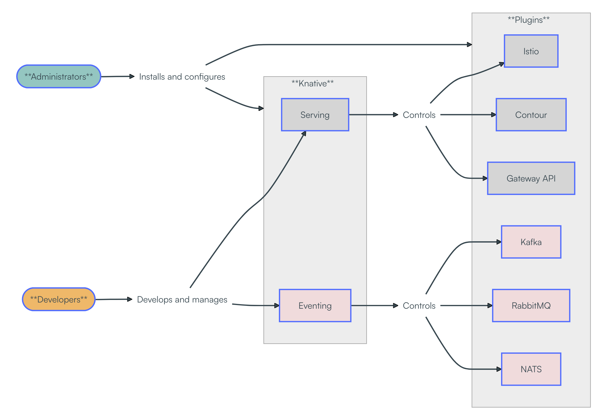

# Overview
概述

* https://knative.dev/docs/admin/admin-overview/

This page provides guidance for administrators on how to manage Knative on an existing Kubernetes cluster. Knative administrators install and configure both or either of the Serving and Eventing components along with default or preferred plugins.
本页面为管理员提供在现有 Kubernetes 集群上管理 Knative 的指南. Knative 管理员可以安装并配置 Serving 和 Eventing 组件(或其中之一), 以及默认或首选插件.

Administrators can use Knative to provide developers with a simple experience for interacting with clusters and deploying applications. In this model, developers primarily interact with Knative resources like Services, Brokers, and Triggers. Because Knative can interoperate with core Kubernetes objects, developers can also use existing Kubernetes tools such as pods, services, networking, identity, and storage where needed. Developers looking to further simplify the deployment experience can define functions with the Knative Functions programming model. The following illustration shows the roles of administrators and developers in this model:
管理员可以使用 Knative 为开发人员提供与集群交互和部署应用程序的简易体验. 在此模型中, 开发人员主要与 Knative 资源(例如 Service、Broker 和 Triggers)进行交互. 由于 Knative 可以与 Kubernetes 核心对象互操作, 开发人员还可以根据需要使用现有的 Kubernetes 工具, 例如 Pod、Service、网络、身份和存储. 希望进一步简化部署体验的开发人员可以使用 Knative Functions 编程模型定义函数. 下图展示了此模型中管理员和开发人员的角色:

As a cluster administrator, your responsibilities include managing the Kubernetes environment, installing cluster-wide components, and enabling developers to deploy applications on the cluster. Knative aims to simplify developer tasks, while aligning with existing management tools and processes.
作为集群管理员, 您的职责包括管理 Kubernetes 环境、安装集群级组件, 以及支持开发人员在集群上部署应用程序. Knative 旨在简化开发人员的任务, 同时与现有的管理工具和流程保持一致.

Knative includes a plugin system to integrate with existing infrastructure in the cluster, enabling Knative resources such as Routes and Brokers to be implemented using one of multiple underlying suppliers. For example, a Knative Eventing app can deliver events to a Broker that triggers a function based on the received event. In a testing cluster, the delivery might use an in-memory option, while a staging or production environment might use a cloud-provided Kafka service.
Knative 包含一个插件系统, 可与集群中现有的基础设施集成, 从而支持使用多种底层供应商之一来实现路由和代理等 Knative 资源. 例如, Knative Eventing 应用可以将事件传递给代理, 代理会根据接收到的事件触发相应的函数. 在测试集群中, 事件传递可能使用内存方案, 而在预发布或生产环境中, 则可能使用云端提供的 Kafka 服务.

Of particular interest to cluster administrators is that Knative supports customizable *default values* on the parameters defined in resource YAML files. These configurations reduce the amount of environment configuration tasks developers need to consider.
集群管理员尤其关注的是, Knative 支持对资源 YAML 文件中定义的参数设置可自定义的*默认值*. 这些配置减少了开发人员需要考虑的环境配置任务数量.

## Installation decisions
安装决策

See the [Installation roadmap](https://knative.dev/docs/install/#installation-roadmap) for prerequisites and installation steps. Your first installation decision is whether to use a YAML-based installation or use the Knative Operator. The Knative Operator is a custom controller that extends the Kubernetes API to install Knative components. If you just need to get acquainted with Knative at this time, you can install the [quickstart](https://knative.dev/docs/getting-started/quickstart-install/).
请参阅[安装路线图](https://knative.dev/docs/install/#installation-roadmap), 了解先决条件和安装步骤. 您首先需要决定是使用基于 YAML 的安装方式还是使用 Knative Operator. Knative Operator 是一个自定义控制器, 它扩展了 Kubernetes API 以安装 Knative 组件. 如果您目前只是想熟悉 Knative, 可以安装[快速入门指南](https://knative.dev/docs/getting-started/quickstart-install/).

The method you use to install Knative is not permanent and you can install clusters differently depending on the situation. Although transitioning between installation methods on one cluster is possible, new installations on separate clusters is the better-tested and officially supported approach.
您使用的 Knative 安装方法并非永久性的, 您可以根据实际情况采用不同的集群安装方式. 虽然可以在同一集群上切换安装方法, 但在不同的集群上进行全新安装才是经过更充分测试且获得官方支持的方法.

### Upgrades
升级

Administrators are generally responsible for performing upgrades to cluster infrastructure, apps, and services. Knative is designed and tested for continuous operation during upgrades and rollbacks, allowing you to:
管理员通常负责对集群基础架构、应用程序和服务进行升级. Knative 经过专门设计和测试, 可在升级和回滚期间实现持续运行, 使您能够:

- Upgrade or revert the Knative components while it is serving traffic, rather than needing a maintenance window.
  在 Knative 组件仍在处理流量时对其进行升级或回滚, 而无需等待维护窗口.

- Downgrade by one Knative version. Downgrades work provided that no applications have used new features since the last upgrade.
  将 Knative 版本降级一级. 降级操作的前提是, 自上次升级以来, 没有任何应用程序使用了新功能.

## Securing Knative
确保 Knative 的安全

Knative resources are namespaced. Knative adheres to the Kubernetes model of namespace-based isolation that lets you manage development teams and resources by assigning them to namespaces. You may also grant developers access to additional resources related to their namespace in other services, such as observability, logs, metrics, tracing, and dashboards.
Knative 资源采用命名空间. Knative 遵循 Kubernetes 基于命名空间的隔离模型, 允许您通过将开发团队和资源分配到不同的命名空间来管理它们. 您还可以授予开发人员访问其他服务中与其命名空间相关的额外资源的权限, 例如可观测性、日志、指标、追踪和仪表盘.

Namespaces can also isolate boundaries for tooling such as logs, metrics, tracing, CI/CD integrations, and dashboards. The extent of this isolation depends on both the enforcement strategy and how consistently teams adhere to namespace boundaries.
命名空间还可以隔离日志、指标、追踪、CI/CD 集成和仪表盘等工具的边界. 这种隔离程度取决于强制执行策略以及团队遵守命名空间边界的一致性.

You can optimize and enforce isolation involving namespaces using standard Kubernetes mechanisms, including:
您可以使用标准的 Kubernetes 机制来优化和强制执行涉及命名空间的隔离, 包括:

- [Role-Based Access Control (RBAC)](https://kubernetes.io/docs/reference/access-authn-authz/rbac/)

- [Resource Quotas](https://kubernetes.io/docs/concepts/policy/resource-quotas/)

- [Network Policies](https://kubernetes.io/docs/concepts/services-networking/network-policies/)

- [Pod Security Standards](https://kubernetes.io/docs/concepts/security/pod-security-standards/)

## Configurations
配置

Knative configurations are performed by the following methods:
Knative 配置可通过以下方法执行:

- Editing YAML manifests and applying with the `kubectl` tool
  编辑 YAML 清单并使用 `kubectl` 工具应用

  Modify resource definitions directly, including labels, annotations, and field values. You can use Kubernetes features such as [OPA](https://kubernetes.io/blog/2019/08/06/opa-gatekeeper-policy-and-governance-for-kubernetes/) and [Kyverno](https://kyverno.io/) to enforce specific values on a resource type, or use ConfigMaps in plugin installations to set values at the cluster level.
  您可以直接修改资源定义, 包括标签、注解和字段值. 您可以使用 Kubernetes 的 [OPA](https://kubernetes.io/blog/2019/08/06/opa-gatekeeper-policy-and-governance-for-kubernetes/) 和 [Kyverno](https://kyverno.io/) 等功能来强制执行资源类型的特定值, 或者在插件安装中使用 ConfigMap 在集群级别设置值.

- Using ConfigMaps

  Store and manage configuration data as key-value pairs. ConfigMaps are frequently used to tune platform-wide behavior. Most of the Knative ConfigMaps are in the `knative-serving` and `knative-eventing` namespaces. Their settings apply to all the relevant Knative components in all namespaces.
  以键值对的形式存储和管理配置数据. ConfigMap 常用于调整平台级行为. 大多数 Knative ConfigMap 位于 `knative-serving` 和 `knative-eventing` 命名空间中. 它们的设置适用于所有命名空间中所有相关的 Knative 组件.

  See [Working with ConfigMaps](https://knative.dev/docs/admin/editing-configmaps/) for important usage information and best practices.
  有关重要的使用信息和最佳实践, 请[参阅"使用 ConfigMaps"](https://knative.dev/docs/admin/editing-configmaps/).

- Using the Knative Operator

  Some platform-wide settings can be managed declaratively using the Knative Operator, installed with the `kn` Knative CLI plugin. You can manage the operator without using the `kn` CLI. The `kn` CLI manages only operator installations.
  某些平台级设置可以通过 Knative Operator 以声明方式进行管理,  `kn` Operator 通过 `kn` Knative CLI 插件安装. 您也可以不使用 `kn` CLI 来管理 Operator. kn CLI 仅用于管理 Operator 的安装.

  For more information, see [Configuring Knative by using the Operator](https://knative.dev/docs/install/operator/configuring-with-operator/) and [CLI tools](https://knative.dev/docs/client/).
  有关更多信息, 请参阅[使用 Operator](https://knative.dev/docs/install/operator/configuring-with-operator/) 和 [CLI 工具](https://knative.dev/docs/client/)配置 Knative.

Knative uses Kubernetes YAML manifests to define and configure system components. These manifests include core resources, custom resource definitions (CRDs), and extensibility features. As with Kubernetes, these configuration resources are declarative and can be managed using the `kubectl` CLI tool or with continuous delivery tools.
Knative 使用 Kubernetes YAML 清单来定义和配置系统组件. 这些清单包括核心资源、自定义资源定义 (CRD) 和可扩展性功能. 与 Kubernetes 一样, 这些配置资源是声明式的, 可以使用 `kubectl` 命令行工具或持续交付工具进行管理.

The following sections provide an overview of the current configuration resources of interest to Administrators. You can edit these configurations using `kubectl`; Knative installs empty ConfigMaps with these names onto the cluster.
以下各节概述了管理员当前需要关注的配置资源. 您可以使用 `kubectl` 编辑这些配置; Knative 会将这些名称的空 ConfigMap 安装到集群上.

### Serving configurations

| Configuration                                                                                                           | ConfigMap            | Description                                                                                                                                              |
| ----------------------------------------------------------------------------------------------------------------------- | -------------------- | -------------------------------------------------------------------------------------------------------------------------------------------------------- |
| [Default configurations](https://knative.dev/docs/serving/configuration/config-defaults/)                               | `config-defaults`    | Default resource values such as performance, hardware, and storage settings.   性能、硬件和存储设置等默认资源值.                                      |
| [Deployment resources](https://knative.dev/docs/serving/configuration/deployment/)                                      | `config-deployment`  | Kubernetes deployment resources that back Knative services.   支持 Knative 服务的 Kubernetes 部署资源.                                                |
| [Domain names](https://knative.dev/docs/serving/using-a-custom-domain/)                                                 | `config-domain`      | Configure and publish domains.   配置并发布域.                                                                                                        |
| [Garbage collection](https://knative.dev/docs/serving/revisions/revision-admin-config-options/)                         | `config-gc`          | Disable and enable collection and set retention time values.   禁用和启用数据采集, 并设置数据保留时间值.                                              |
| [Ingress gateway](https://knative.dev/docs/serving/setting-up-custom-ingress-gateway/)                                  | `config-istio`       | For new clusters, you can configure your own gateway and underlying service.   对于新建集群, 您可以配置自己的网关和底层服务.                          |
| [Istio authorization](https://knative.dev/docs/serving/istio-authorization/)                                            | NA                   | Grant authorization to your deployed Knative services.   授予已部署的 Knative 服务授权.                                                               |
| [Rollout duration for revisions](https://knative.dev/docs/serving/configuration/rolling-out-latest-revision-configmap/) | `config-network`     | Adjust rollout durations to accommodate longer request queues.   调整发布周期以适应更长的请求队列.                                                    |
| [Security - Certificates](https://knative.dev/docs/serving/encryption/configure-certmanager-integration/)               | `config-certmanager` | Describes how to manage automatic certificate provisioning.   介绍如何管理自动证书配置.                                                               |
| [Security - Encryptions](https://knative.dev/docs/serving/encryption/encryption-overview/)                              | `config-network`     | Provides links to procedures for encrypting external domains, the local cluster, and system internal.   提供加密外部域、本地集群和系统内部的程序链接. |

### Eventing configurations

| Configuration                                                                                                              | ConfigMap               | Description                                                                                                                                                                                                                                                                                                                                                      |
| -------------------------------------------------------------------------------------------------------------------------- | ----------------------- | ---------------------------------------------------------------------------------------------------------------------------------------------------------------------------------------------------------------------------------------------------------------------------------------------------------------------------------------------------------------- |
| [Broker defaults](https://knative.dev/docs/eventing/configuration/broker-configuration/)                                   | `config-br-defaults`    | Specify your own broker class and channel, or use the default `MTChannelBasedBroker` Broker class and the ConfigMap of channel defaults.   指定您自己的代理类和通道, 或者使用默认的 `MTChannelBasedBroker` 代理类和通道默认值的 ConfigMap.                                                                                                                    |
| [Broker features (Kafka)](https://knative.dev/docs/eventing/brokers/broker-types/kafka-broker/configuring-kafka-features/) | `config-kafka-features` | Configure options for Broker interactions with Apache Kafka clusters.   配置 Broker 与 Apache Kafka 集群交互的选项.                                                                                                                                                                                                                                           |
| [Channel defaults](https://knative.dev/docs/eventing/configuration/channel-configuration/)                                 | `default-ch-webhook`    | Default configurations and labels to use for the channel.   频道的默认配置和标签.                                                                                                                                                                                                                                                                             |
| [Channel defaults (Kafka)](https://knative.dev/docs/eventing/configuration/kafka-channel-configuration/)                   | `kafka-channel`         | Defines how KafkaChannel instances are created. Requires that KafkaChannel custom resource definitions (CRD) are installed.   定义 KafkaChannel 实例的创建方式. 需要安装 KafkaChannel 自定义资源定义 (CRD).                                                                                                                                                   |
| [Event source defaults](https://knative.dev/docs/eventing/configuration/sources-configuration/)                            | `config-ping-defaults`  | Configure the PingSource default resources and the maximum data size for CloudEvents it produces.   配置 PingSource 默认资源及其生成的 CloudEvents 的最大数据大小.                                                                                                                                                                                            |
| [KEDA Autoscaling of Kafka Resources](https://knative.dev/docs/eventing/configuration/keda-configuration/)                 | `config-kafka-features` | Configure how KEDA scales a KafkaSource, trigger, or subscription. Note: This feature is is Alpha pre-release.   配置 KEDA 如何扩展 KafkaSource、触发器或订阅. 注意: 此功能目前处于 Alpha 预发布阶段.                                                                                                                                                         |
| [Sugar Controller](https://knative.dev/docs/eventing/sugar/)                                                               | `config-sugar`          | Configure the Sugar controller, which reacts to label configurations to produce or control eventing resources. See also [Knative Eventing Sugar Controller](https://knative.dev/docs/eventing/sugar/).   配置 Sugar 控制器, 该控制器响应标签配置以生成或控制事件资源. 另请参阅 [Knative Eventing Sugar Controller](https://knative.dev/docs/eventing/sugar/). |

### Common configurations

| Configuration                                                                                | ConfigMap | Description                                                                                                       |
| -------------------------------------------------------------------------------------------- | --------- | ----------------------------------------------------------------------------------------------------------------- |
| [High-availability](https://knative.dev/docs/serving/config-ha/)                             | NA        | Configure ensure that APIs stay operational if a disruption occurs.   配置以确保 API 在发生中断时仍能正常运行. |
| [Namespace exclusion from webhook](https://knative.dev/docs/serving/webhook-customizations/) | NA        | For performance concerns during an upgrade.   升级过程中可能出现性能问题.                                      |
